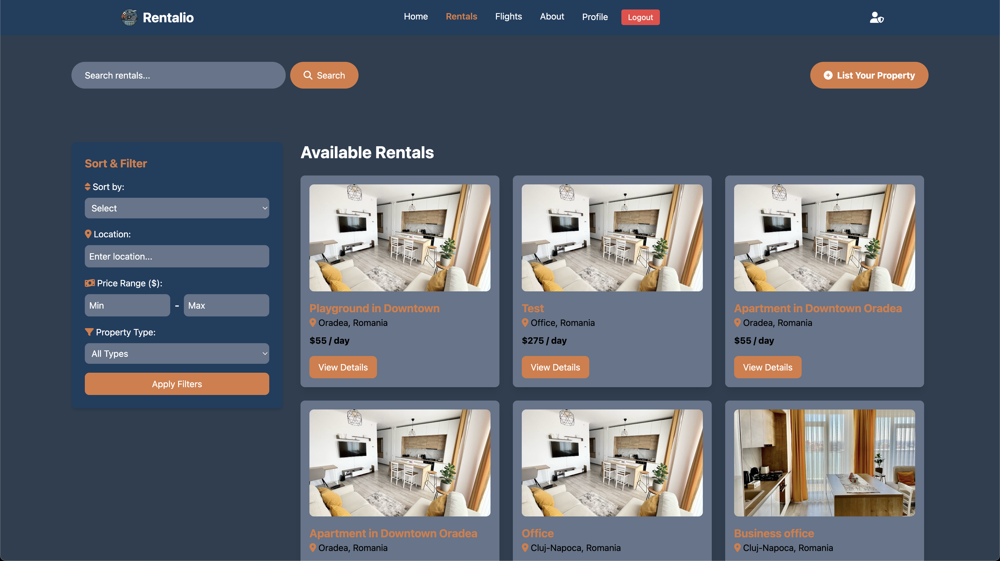
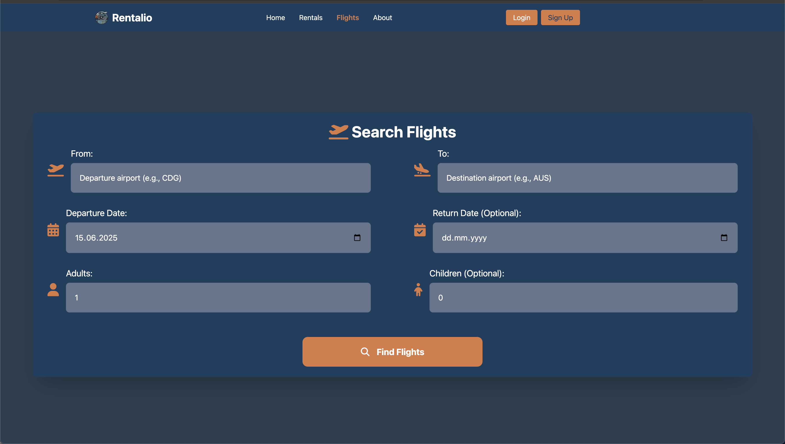
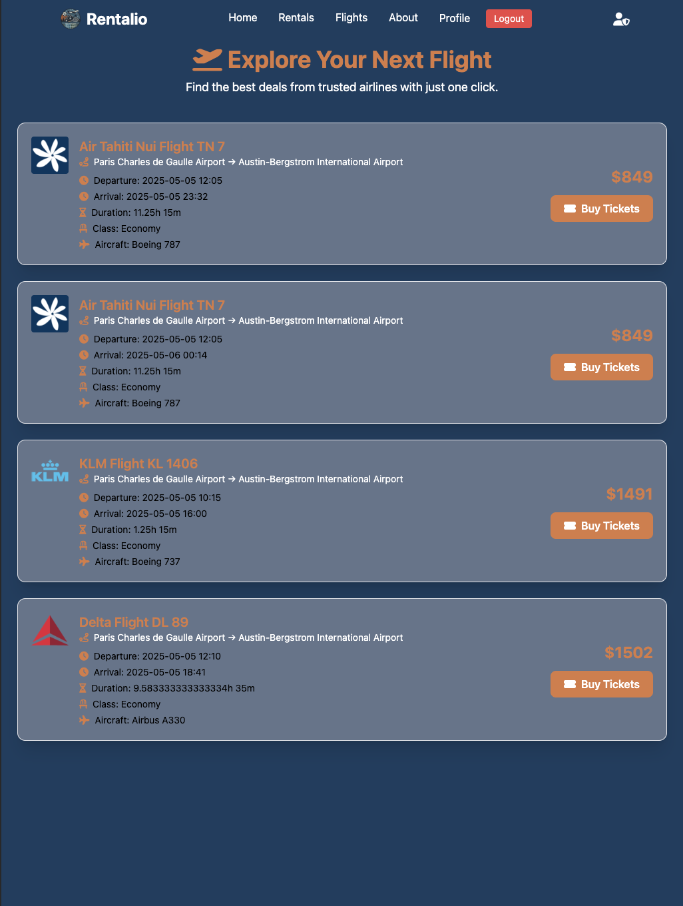
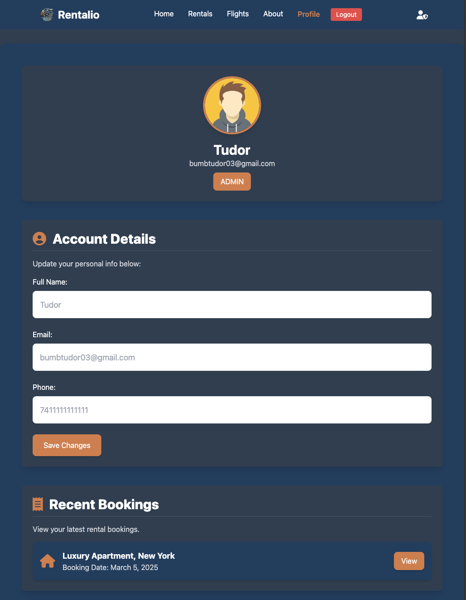
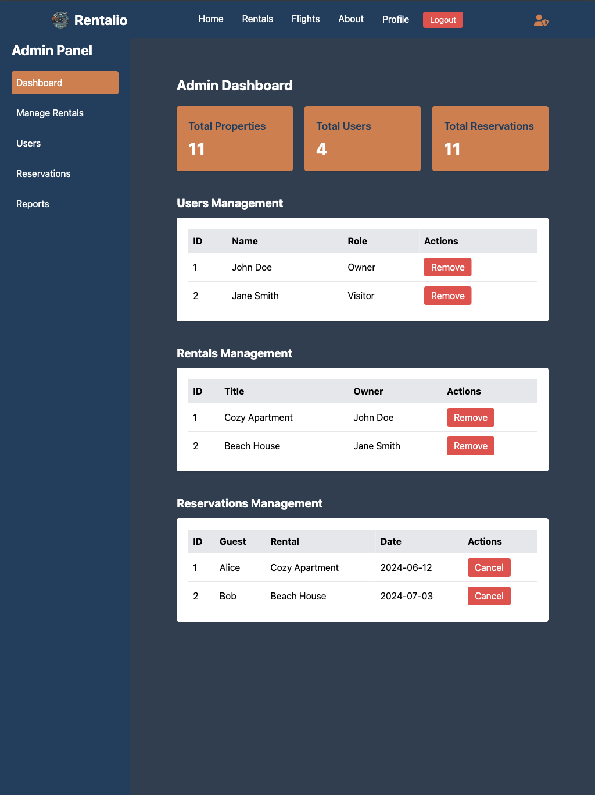

# Rentalio – Full Stack Rental Platform

**Rentalio** is a full-stack web application for managing and renting properties or services such as apartments, playgrounds, or football fields. The platform supports listing creation, user authentication, booking/reservations, payment handling, and review features.

Built with:

- **Angular** (Frontend UI)

- **Node.js + Express** (Backend API)

- **MongoDB** (NoSQL Database)

- **Docker && Docker-compose** (for containerization and local development)

## Tech Stack Summary

| Technology       | Stack                   |
| ---------------- | ----------------------- |
| Frontend         | Angular 19 + Tailwind   |
| Backend          | Node.js + Express       |
| Database         | MongoDB                 |
| Containerization | Docker & Docker Compose |
| ORM              | Mongoose                |

## Preview

Here are a few screenshots of the UI:









## Project Structure

```
Rentalio/
├── backend/          # Express API server with Mongoose schemas
├── db/               # MongoDB migrations & seeders
├── docs/             # UI screenshots
├── env/              # Environments variables
├── frontend/         # Angular 19+ SPA for client interaction
├── .gitignore
├── docker-compose.yaml
├── LICENSE
└── README.md         # Main project introduction (you are here)
```

## Features

✅ User authentication (register/login/logout) <br>
✅ Visitor, Owner and Admin roles <br>
✅ Create/edit/delete listings <br>
✅ Filter/search listings (by city, category, price, etc.) <br>
✅ Reserve listings (by hour, day, week...) <br>
✅ Email and form validation <br>
✅ Track reservations and prevent date overlap <br>
✅ View booking details, handle payment methods <br>
✅ Basic admin features (user and role management) <br>
✅ Mobile responsive UI using TailwindCSS <br>

## Quick Start

### 1. Clone the repository:

```bash
git clone https://github.com/tudor555/Rental-website-license-project.git
cd Rental-website-license-project
```

### 2. Environment Setup

- For `database` & `backend`:

```bash
cd env/db_env/
cp db.env.example db.env

cd env/backend_env/api_env
cp api.env.example api.env
```

- For `frontend`:

```bash
cd frontend/rental-ui
cp src/environments/environment.example.ts src/environments/environment.ts
```

✅ After copying, update the values inside each `.env` file to match your local or production configuration.

### 3.Start the full project with Docker Compose

Simply run from project root:

```bash
docker compose up -d
```

🐳 This will automatically:

- Start MongoDB
- Start backend API server
- Start Angular frontend (served through Docker)

### 4. Access the platform

Open your browser and navigate to:

```arduino
http://localhost:4200/
```

You should see the fully running `Rentalio` application.

### 5. Optional — Database Migration & Seed

If you're running for the first time, you may want to run the migrations and optional seeders:

```bash
cd db
npm install

# Run migrations
npm run migrate:all

# Seed reservations (optional — usually run only once)
npm run seed:all
```

## 📚 Documentation

| Section                                        | Description                                                |
| ---------------------------------------------- | ---------------------------------------------------------- |
| 📦 [Backend Setup](./backend/README.md)        | Express server, authentication, routing, environment setup |
| 🧾 [Backend API Docs](./backend/api/README.md) | All API routes: listings, reservations, auth, users, etc.  |
| 🧮 [DB Migrations](./db/README.md)             | MongoDB structure, scripts, seeding & setup                |
| 🎨 [Frontend Setup](./frontend/README.md)      | Angular structure, UI, Tailwind, components, etc.          |

## 💡 Contributing

This project is still under active development.
Feel free to fork, improve or suggest changes via pull request.

## ⚠️ Notes

- Some modules like **reviews** and **payment** processing are under construction.
- For **production** builds, you'll need to adjust environment.prod.ts and secure secrets.
- Full application can be managed via Docker Compose for both development and production.
